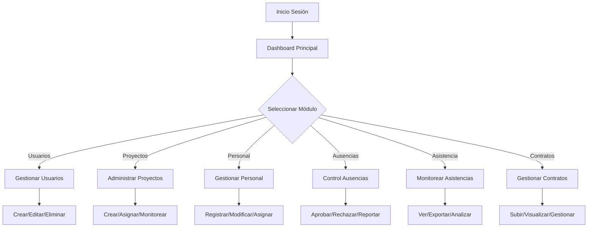
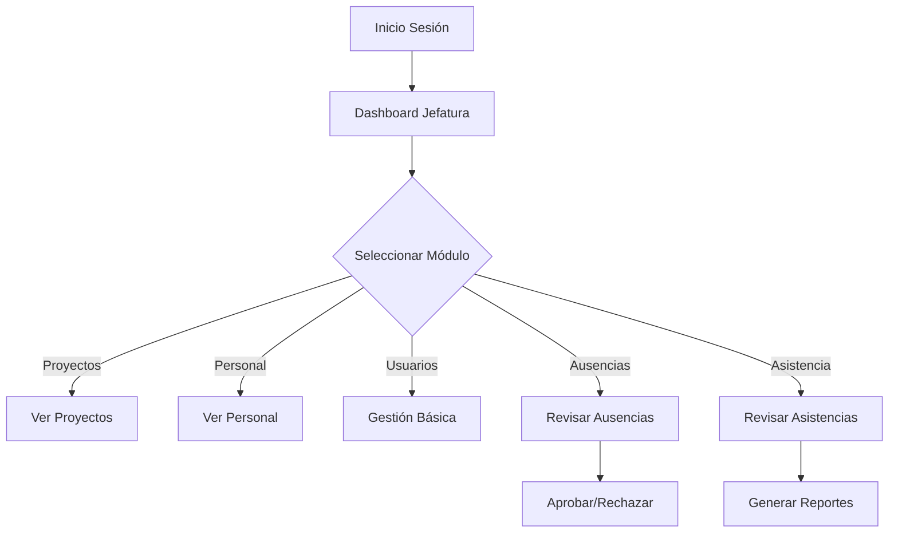
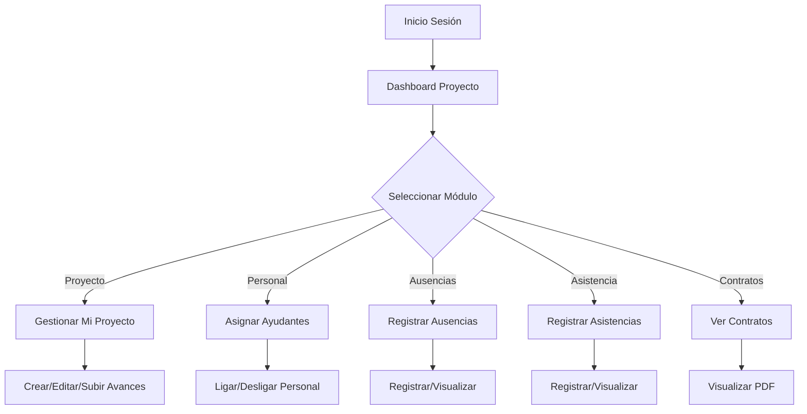
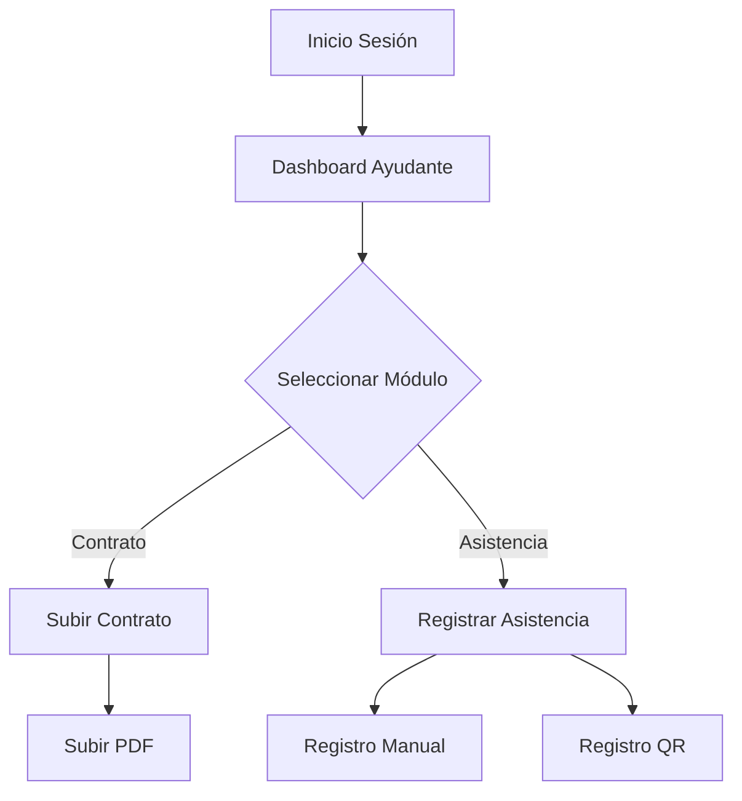

# 👥 Sistema de Roles y Permisos

## 🎯 Overview del Sistema

El Sistema de Asistencia Universitaria está diseñado con 4 roles principales, cada uno con permisos específicos y acceso a módulos diferenciados según sus responsabilidades.

---

## 🔐 Roles del Sistema

### 👑 **Administrador**
**Nivel de acceso:** Control total del sistema

#### 📋 **Módulos Disponibles:**
- **👥 Usuarios** - Gestión completa de usuarios
- **📁 Proyectos** - Administración de todos los proyectos
- **👤 Personal** - Gestión de personal completo
- **📅 Ausencias** - Control de todas las ausencias
- **⏰ Asistencia** - Monitoreo general de asistencias
- **📄 Contrato** - Gestión de contratos

#### 🛠️ **Permisos Específicos:**
- ✅ **Crear, editar, eliminar** usuarios
- ✅ **Asignar roles** y permisos
- ✅ **Crear y gestionar** todos los proyectos
- ✅ **Registrar y modificar** personal
- ✅ **Aprobar/rechazar** todas las ausencias
- ✅ **Ver todas las asistencias** del sistema
- ✅ **Subir y gestionar** contratos
- ✅ **Acceso a reportes** y métricas globales
- ✅ **Configuración del sistema**

---

### 👔 **Jefatura**
**Nivel de acceso:** Supervisión y aprobación

#### 📋 **Módulos Disponibles:**
- **📁 Proyectos** - Supervisión de proyectos
- **👤 Personal** - Visualización de personal
- **👥 Usuarios** - Gestión limitada
- **📅 Ausencia** - Revisión y aprobación
- **⏰ Asistencia** - Revisión de asistencias

#### 🛠️ **Permisos Específicos:**
- ✅ **Visualizar todos los proyectos**
- ✅ **Ver información del personal**
- ✅ **Revisar y aprobar** solicitudes de ausencia
- ✅ **Revisar asistencias** del personal
- ✅ **Generar reportes** de su área
- ❌ **No puede crear proyectos**
- ❌ **No puede eliminar usuarios**
- ❌ **No puede modificar contratos**

#### 🔄 **Flujo de Trabajo:**
1. **Recibe notificaciones** de avances de proyectos
2. **Revisa solicitudes** de ausencia del personal
3. **Aprueba/rechaza** ausencias con comentarios
4. **Monitorea asistencias** del personal a su cargo
5. **Genera reportes** periódicos

---

### 👨‍💼 **Director de Proyecto**
**Nivel de acceso:** Gestión de proyecto específico

#### 📋 **Módulos Disponibles:**
- **📁 Proyecto** - Gestión completa de su proyecto
- **👤 Personal** - Gestión de personal asignado
- **📅 Ausencia** - Registro y visualización
- **⏰ Asistencia** - Registro y visualización
- **📄 Contrato** - Visualización de contratos

#### 🛠️ **Permisos Específicos:**
- ✅ **Crear y editar** su propio proyecto
- ✅ **Ligar personal** con su proyecto
- ✅ **Ver información del contrato** si está subido
- ✅ **Visualizar contratos** en PDF
- ✅ **Registrar ausencias** de sus ayudantes
- ✅ **Visualizar ausencias** de su equipo
- ✅ **Registrar asistencias** de pasantes
- ✅ **Visualizar asistencias** de su equipo
- ✅ **Subir avances** del proyecto
- ❌ **No puede ver otros proyectos**
- ❌ **No puede modificar contratos**
- ❌ **No puede gestionar usuarios**

#### 🔄 **Flujo de Trabajo:**
1. **Crea y configura** su proyecto
2. **Asigna personal** (ayudantes) al proyecto
3. **Registra ausencias** cuando los ayudantes faltan
4. **Monitorea asistencias** diarias
5. **Sube avances** periódicos del proyecto
6. **Recibe feedback** de jefatura

---

### 🧑‍🔬 **Ayudante**
**Nivel de acceso:** Operaciones básicas

#### 📋 **Módulos Disponibles:**
- **📄 Contrato** - Subida de documentos
- **⏰ Asistencia** - Registro personal

#### 🛠️ **Permisos Específicos:**
- ✅ **Subir contrato** en formato PDF
- ✅ **Registrar asistencia** en laboratorio
- ✅ **Registrar asistencia** con código QR
- ✅ **Ver su propio contrato**
- ❌ **No puede ver otros módulos**
- ❌ **No puede modificar datos**
- ❌ **No tiene acceso administrativo**

#### 🔄 **Flujo de Trabajo:**
1. **Sube su contrato** al sistema
2. **Registra asistencia** diaria
3. **Puede usar QR** para registro rápido
4. **Visualiza su historial** de asistencias

---

## 🔄 **Flujos de Trabajo por Rol**

### 👑 **Administrador - Flujo Completo**

### 👔 **Jefatura - Flujo de Supervisión**

### 👨‍💼 **Director - Flujo de Proyecto**

### 🧑‍🔬 **Ayudante - Flujo Básico**

---

## 📊 **Matriz de Permisos**

| Módulo | Administrador | Jefatura | Director | Ayudante |
|--------|---------------|-----------|-----------|----------|
| **Usuarios** | ✅ CRUD | 📖 Ver | ❌ | ❌ |
| **Proyectos** | ✅ CRUD | 📖 Ver | ✅ Solo suyo | ❌ |
| **Personal** | ✅ CRUD | 📖 Ver | ✅ Asignar | ❌ |
| **Ausencias** | ✅ CRUD | ✅ Aprobar | ✅ Registrar | ❌ |
| **Asistencia** | ✅ Ver Todo | ✅ Revisar | ✅ Registrar | ✅ Solo la suya |
| **Contratos** | ✅ CRUD | ❌ | 📖 Ver | ✅ Subir |

**Leyenda:**
- ✅ CRUD = Crear, Leer, Actualizar, Eliminar
- 📖 Ver = Solo lectura
- ❌ = Sin acceso

---

## 🔔 **Notificaciones por Rol**

### 👑 **Administrador**
- 📧 **Creación de usuarios** - Credenciales enviadas
- 📧 **Cambios importantes** - Notificaciones de sistema
- 📧 **Reportes automáticos** - Métricas y estadísticas

### 👔 **Jefatura**
- 📧 **Avances de proyectos** - Para revisión
- 📧 **Solicitudes de ausencia** - Para aprobación
- 📧 **Reportes periódicos** - De su área

### 👨‍💼 **Director de Proyecto**
- 📧 **Ausencias de ayudantes** - Notificación automática
- 📧 **Aprobación de avances** - Feedback de jefatura
- 📧 **Asignación de personal** - Confirmación

### 🧑‍🔬 **Ayudante**
- 📧 **Credenciales de acceso** - Al registrarse
- 📧 **Confirmación de contrato** - Al subir documento
- 📧 **Recordatorios** - De asistencia o tareas

---

## 🎯 **Casos de Uso Típicos**

### 👑 **Administrador**
1. **Crea nuevo usuario** - Asigna rol de Director
2. **Configura proyecto** - Define parámetros iniciales
3. **Agrega personal** - Registra ayudantes
4. **Monitorea sistema** - Revisa métricas globales
5. **Resuelve problemas** - Gestiona incidencias

### 👔 **Jefatura**
1. **Recibe notificación** de nuevo avance
2. **Revisa documentación** del avance
3. **Aprueba/rechaza** con comentarios
4. **Monitorea ausencias** del personal
5. **Genera reportes** mensuales

### 👨‍💼 **Director**
1. **Crea su proyecto** - Define objetivos
2. **Asigna ayudantes** - A su proyecto
3. **Registra ausencia** de ayudante enfermo
4. **Sube avance** mensual del proyecto
5. **Recibe feedback** de jefatura

### 🧑‍🔬 **Ayudante**
1. **Sube su contrato** - Al sistema
2. **Registra asistencia** - Diaria en lab
3. **Usa código QR** - Para registro rápido
4. **Visualiza su historial** - De asistencias
5. **Recibe notificaciones** - Del director

---

## 🚀 **Implementación Técnica**

### **Autenticación y Autorización**
- **JWT Tokens** para autenticación
- **Role-based access control (RBAC)**
- **Middleware de permisos** por ruta
- **Validación de acceso** a módulos

### **Base de Datos**
- **Tabla usuarios** con rol asignado
- **Relaciones** entre usuarios y proyectos
- **Permisos** almacenados por rol
- **Auditoría** de acciones realizadas

### **Frontend**
- **Rutas protegidas** por rol
- **Componentes condicionales** según permisos
- **Navegación dinámica** por rol
- **Dashboard personalizado**

---

## 📈 **Métricas y Monitoreo**

### **Por Rol**
- **Administrador:** Actividad global del sistema
- **Jefatura:** Eficiencia de aprobaciones
- **Director:** Progreso de proyectos
- **Ayudante:** Tasa de asistencia

### **Indicadores Clave**
- **Tiempo de respuesta** a solicitudes
- **Tasa de aprobación** de ausencias
- **Frecuencia de avances** de proyectos
- **Cumplimiento de asistencia**

---

## 🔒 **Consideraciones de Seguridad**

### **Por Rol**
- **Principio de mínimo privilegio**
- **Segregación de responsabilidades**
- **Auditoría de accesos**
- **Encriptación de datos sensibles**

### **Validaciones**
- **Autenticación multifactor** para administradores
- **Sesiones con timeout** configurable
- **Logs de actividad** detallados
- **Backup y recuperación** de datos

---

## 🎉 **Resumen del Sistema**

El sistema está diseñado para proporcionar una **gestión eficiente y segura** de la asistencia universitaria, con **roles bien definidos** que aseguran que cada usuario tenga acceso **exactamente a lo que necesita** para realizar sus funciones, manteniendo la **integridad y seguridad** de la información.

### **Ventajas Principales:**
- 🎯 **Claridad** en responsabilidades
- 🔒 **Seguridad** por capas de acceso
- 📊 **Escalabilidad** para crecimiento
- 🔄 **Eficiencia** en flujos de trabajo
- 📈 **Métricas** para mejora continua

**¡Un sistema robusto, flexible y adaptado a las necesidades específicas de la gestión universitaria!** 🚀✨
